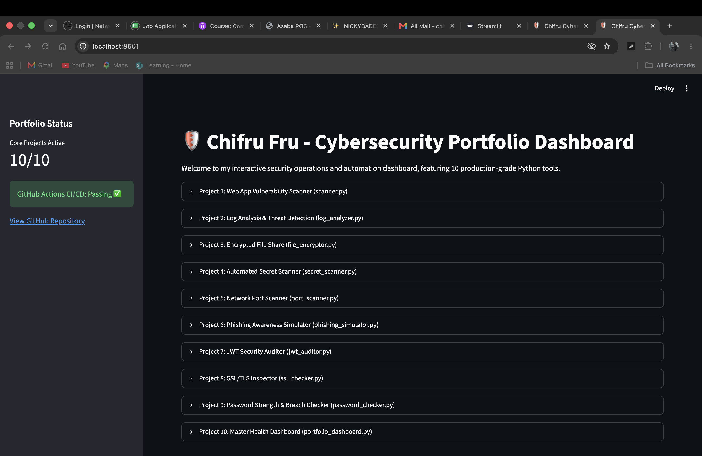

# 🛡️ Cybersecurity & DevSecOps Portfolio

Welcome to my professional cybersecurity engineering and automation portfolio! This repository contains **10 production-grade Python tools** designed to automate security tasks, audit vulnerabilities, implement cryptography, and enforce DevSecOps best practices.

---

## 📊 Interactive Dashboard Preview

You can launch the interactive Streamlit dashboard locally by running:
`streamlit run app.py`

---

## 🛠️ Project Inventory (10/10 Completed)

| Project ID | Script Name | Description |
| :--- | :--- | :--- |
| **Project 1** | `scanner.py` | Web Application Vulnerability Scanner (Headers & Exposed Files) |
| **Project 2** | `log_analyzer.py` | Log Analysis & Threat Detection (Brute-Force & Reconnaissance) |
| **Project 3** | `file_encryptor.py` | Encrypted File Share & Secure Uploader (Fernet Symmetric Encryption) |
| **Project 4** | `secret_scanner.py` | Automated Git Repository Secret Scanner (Regex Credential Leak Detector) |
| **Project 5** | `port_scanner.py` | Network Port Scanner (Multi-threaded TCP Socket Mapper) |
| **Project 6** | `phishing_simulator.py` | Phishing Awareness Simulation Tool (Educational Corporate Templates) |
| **Project 7** | `jwt_auditor.py` | JWT Security Auditor (Misconfiguration & Signature Bypass Checker) |
| **Project 8** | `ssl_checker.py` | SSL/TLS Certificate Expiration & Security Inspector |
| **Project 9** | `password_checker.py` | Password Strength & Breach Checker (HIBP k-Anonymity API Integration) |
| **Project 10** | `portfolio_dashboard.py` | Master Portfolio Summary & Health Dashboard (CLI & Streamlit Web App) |

---

## 🚀 DevSecOps & CI/CD Pipeline

This repository implements automated continuous integration using **GitHub Actions**. On every push to the `main` branch, the pipeline:
1. Provisions a clean Ubuntu environment with Python 3.12.
2. Installs required security dependencies (`cryptography`, `requests`, `streamlit`).
3. Executes automated health checks and verification scripts to ensure full repository integrity.

---

## 👤 Author

* **Frank Fru**
* **Website:** [frankfru.com](https://frankfru.com)
* **GitHub:** [chifru19](https://github.com/chifru19)
* **Email:** chifru19@googlemail.com
